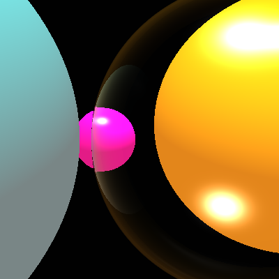
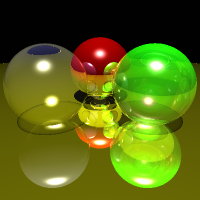

DoubleRay raytracer
===
This project came from a homework assignment I had 12 years ago in my undergraduate computer graphics class (UC Davis ECS175).  The purpose of this project is to modernize and package the raytracer for use in the browser via WASM.  In general I had the idea that this should be able to render semi-realtime, however I'm not sure it's there yet.  The name (Double Ray) is just a play on the double precision float datatype.

[Live Preview](https://esromneb.github.io/DoubleRay/out/ray.html)
===
Click [this live preview](https://esromneb.github.io/DoubleRay/out/ray.html) to render your own images.

Images
===





Project Priorities
===
These are the priorities I kept in mind through development:
* Correctness
* Ease of Use
* Performance
* Code cleanliness


State of things
===
Currently the project is a bit limited in functionality, but it does support:
* Spheres only
* Reflection, Refraction, Diffuse, Specular (phong), light shadows
* Light sources are a direction only, and have no origin
* Multiple shadowing modes

Things I want to add
===
* Poloygon support (triangles)
* Bounding boxes to improve performance
* Diffuse shading that includes reflection from lights
* Spherical light model
* Change FOV (currently fixed at 53.0155)

How to use this project
===
* I'm still trying to understand the best way to publish / include this project.

Travis Details
===
The emscripten travis docker image has some weird issues with clang that I do not understand.  I have opted to use two docker images, one for the png tests, and one to build the wasm.

[](https://travis-ci.com/esromneb/DoubleRay)


Compile
===
```bash
make
```

Run
===
```bash
cd out
sudo python -m SimpleHTTPServer 80
```

open ray.html in firefox (chrome is slower for me)


Notes
===
We use template/controls.html to generate ray.html


Deps
===
On ubuntu:

```bash
git clone https://github.com/emscripten-core/emsdk.git
cd emsdk/
git pull
./emsdk install latest
./emsdk activate latest
source ./emsdk_env.sh
realpath ./emsdk_env.sh 
```

Instructions from: https://emscripten.org/docs/getting_started/downloads.html


See Also Ratracing
===
* https://github.com/mtharrison/wasm-raytracer - a working wasm raytracer
* http://viclw17.github.io/2018/07/16/raytracing-ray-sphere-intersection/ - ray sphere intersection
* https://blog.demofox.org/2017/01/09/raytracing-reflection-refraction-fresnel-total-internal-reflection-and-beers-law/
* https://www.scratchapixel.com/lessons/3d-basic-rendering/phong-shader-BRDF - phong
* http://paulbourke.net/geometry/reflected/ - reflect ray from normal
* http://viclw17.github.io/2018/08/05/raytracing-dielectric-materials/ - dielectric
* https://www.cs.utah.edu/~lediaev/courses/cs6620/prj14.html - goals
* https://www.scratchapixel.com/lessons/3d-basic-rendering/introduction-to-shading/reflection-refraction-fresnel
* https://www.scratchapixel.com/lessons/3d-basic-rendering/ray-tracing-overview/light-transport-ray-tracing-whitted
* http://www.cs.unc.edu/~rademach/xroads-RT/RTarticle.html - texture mapping
* https://github.com/fidofetch/RayCasting-Processing3 - 2d raytracer

See Also RayMarching / Shaders
===
* https://github.com/gpujs/gpu.js/blob/develop/examples/mandelbulb.html
* https://observablehq.com/@ondras/fragment-shader-raytracer - shaders


See Also Emscripten
===
* https://emscripten.org/docs/compiling/Deploying-Pages.html - emscripten instructions for custom html
* https://blog.scottlogic.com/2014/03/12/native-code-emscripten-webgl-simmer-gently.html - webgl
* https://compile.fi/canvas-filled-three-ways-js-webassembly-and-webgl/ - 3 ways to canvas
* https://brionv.com/log/2019/10/24/exception-handling-in-emscripten-how-it-works-and-why-its-disabled-by-default/ - exceptions
* https://emscripten.org/docs/compiling/Travis.html - travis
* https://emscripten.org/docs/api_reference/emscripten.h.html?highlight=build_as_worker#worker-api - workers
* https://livebook.manning.com/book/webassembly-in-action/c-emscripten-macros/v-7/64 - in-depth passing c->js
* https://emscripten.org/docs/porting/connecting_cpp_and_javascript/Interacting-with-code.html
* https://emscripten.org/docs/api_reference/preamble.js.html

See Also Offtopic
===
* https://github.com/antimatter15/jsgif
* https://nlohmann.github.io/json/classnlohmann_1_1basic__json_a8a3dd150c2d1f0df3502d937de0871db.html - nlohmann parse without exception 


Libraries Used
===
* https://github.com/nlohmann/json
* https://github.com/lvandeve/lodepng
* https://github.com/CLIUtils/CLI11
